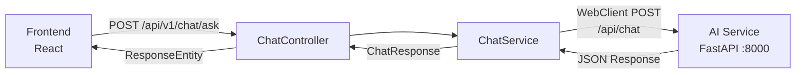

# HistoryMind AI — Backend

Backend service đóng vai trò **API Gateway / Orchestrator** — proxy requests từ Frontend sang AI Service, quản lý business logic. Xây dựng với **Spring Boot 3** + **WebFlux** (reactive).

## 🏗 Kiến trúc



### Vai trò

| Layer | Trách nhiệm |
|-------|-------------|
| **Controller** | Nhận HTTP request, validate, trả response |
| **Service** | Proxy call tới AI Service qua WebClient |
| **Config** | CORS, WebClient bean, AI service URL |
| **DTO** | Data Transfer Objects (request/response contracts) |

> ⚠️ **Backend KHÔNG chứa business logic AI**. Toàn bộ NLU, search, entity resolution do AI Service xử lý.

---

## 📡 API Endpoints

### `POST /api/v1/chat/ask`

Gửi câu hỏi lịch sử, nhận câu trả lời.

**Request:**
```json
{
  "query": "Trần Hưng Đạo là ai?"
}
```

**Response:**
```json
{
  "query": "Trần Hưng Đạo là ai?",
  "answer": "**Trần Hưng Đạo** (tên thật: Trần Quốc Tuấn)...",
  "intent": "definition",
  "events": [
    {
      "id": "hf_000123",
      "year": "1285",
      "story": "Trận Chương Dương...",
      "event": "Kháng chiến chống Nguyên Mông lần 2",
      "persons": ["Trần Hưng Đạo"],
      "keywords": ["kháng_chiến", "nguyên_mông"]
    }
  ],
  "no_data": false
}
```

### `GET /api/v1/ping`

Health check endpoint.

---

## 🧩 Cấu trúc Code

```
BE_HistoryMind_AI/
└── src/main/java/com/historymind/history_service/
    ├── HistoryServiceApplication.java    # Main entry point
    ├── config/
    │   └── WebFluxConfig.java            # CORS + WebClient config
    ├── controller/
    │   ├── ChatController.java           # POST /api/v1/chat/ask
    │   └── PingController.java           # GET /api/v1/ping
    ├── dto/
    │   ├── ChatRequest.java              # { query }
    │   ├── ChatResponse.java             # { answer, events, intent, ... }
    │   └── EventDTO.java                 # { id, year, story, event, ... }
    ├── service/
    │   └── ChatService.java              # WebClient → AI Service proxy
    ├── model/                            # Domain models
    └── exception/                        # Error handling
```

---

## 🔧 Cấu hình

### CORS (`WebFluxConfig.java`)

```java
registry.addMapping("/**")
    .allowedOrigins(
        "http://localhost:3000",           // Local FE
        "https://historymindai.vercel.app"  // Production FE
    )
    .allowedMethods("GET", "POST", "PUT", "DELETE", "OPTIONS")
    .allowedHeaders("*");
```

### AI Service URL

Cấu hình qua `application.properties`:
```properties
ai.service.url=http://localhost:8000
```

---

## 🛠 Cài đặt & Chạy

### Yêu cầu

- Java 17+
- Maven 3.8+

### Local Development

```bash
# Build
./mvnw clean package -DskipTests

# Run
./mvnw spring-boot:run
# → http://localhost:8080
```

> **Lưu ý**: AI Service cần chạy trên port `8000` trước.

### Production (Railway)

Deploy URL: `https://behistorymindai-production.up.railway.app`

---

## 📚 Tech Stack

| Thành phần | Công nghệ |
|-----------|-----------|
| Framework | Spring Boot 3 |
| Reactive | WebFlux + WebClient |
| Build | Maven |
| Language | Java 17 |
| Logging | SLF4J + Logback |
| Deploy | Railway |
